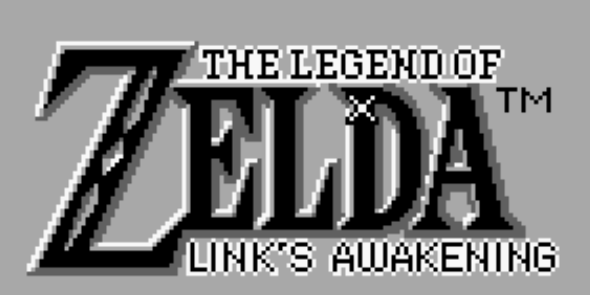

<div align="center">
  
</div>

# The Legend of Zelda: Reinforcement Learning

This repository contains the code for the project "The Legend of Zelda: Reinforcement Learning", it's purpose is to train an agent to play the game "The Legend of Zelda: Link's Awakening" for GameBoy using Reinforcement Learning.

## Installation

Clone the repository

```bash
git clone https://github.com/msosav/zelda-reinforcement-learning
cd zelda-reinforcement-learning
```

Create a virtual environment and activate it

> [!NOTE]
> You need to have python 3.11 installed in your machine.

```bash
python3.11 -m venv venv
source venv/bin/activate
```

Install pytorch

```bash
pip install torch torchvision torchaudio --index-url https://download.pytorch.org/whl/cpu
```

Install the requirements

```bash
pip install -r requirements.txt
```

## Usage

The program is divided into two main parts: the training and the testing.

> [!NOTE]
> You need to create a folder called `roms` in the root of the project and put the rom of the game "The Legend of Zelda: Link's Awakening" for GameBoy in it and name it `ZeldaLinksAwakening.gb`.

### Training

To train the agent, run the following command:

```bash
python main.py train
```

### Testing

To test the agent, run the following command:

```bash
python main.py test ./checkpoints/<checkpoint>.zip
```

Example:

```bash
python main.py test ./checkpoints/best_model_5000.zip
```

## Reward System (WIP)

The reward system is based on the following rules:

- `+1` for each item in the inventory
